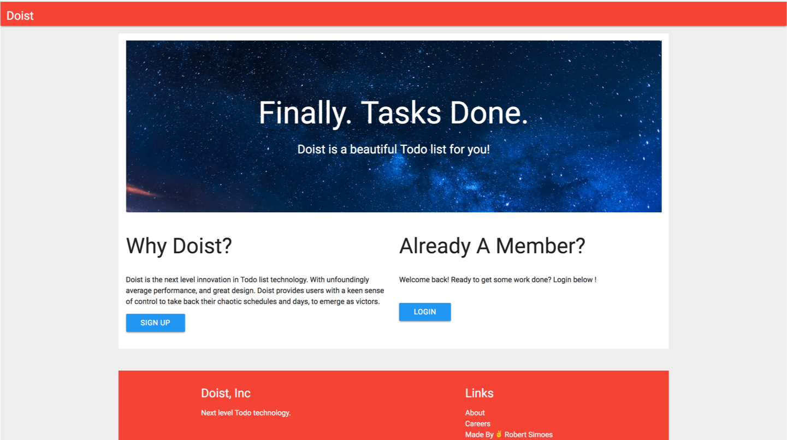
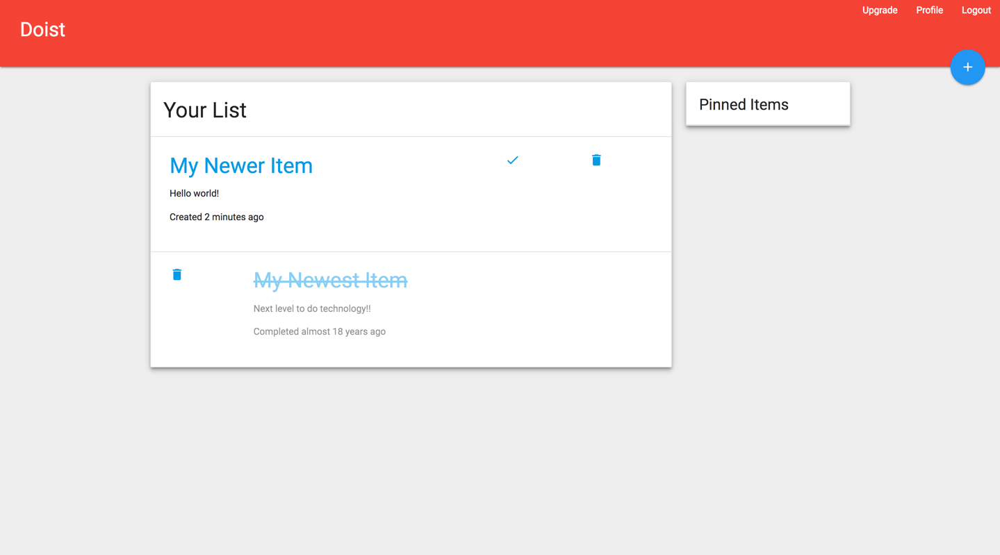
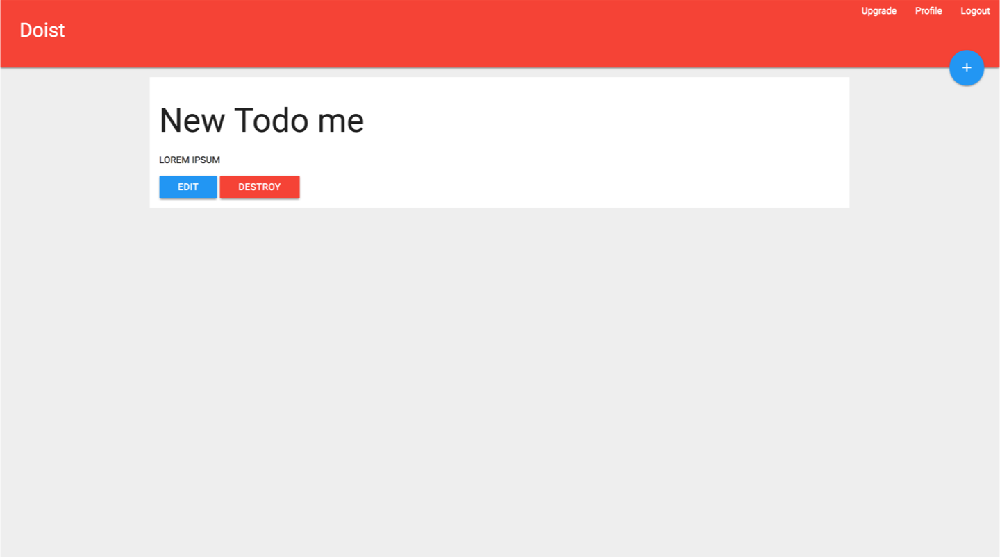
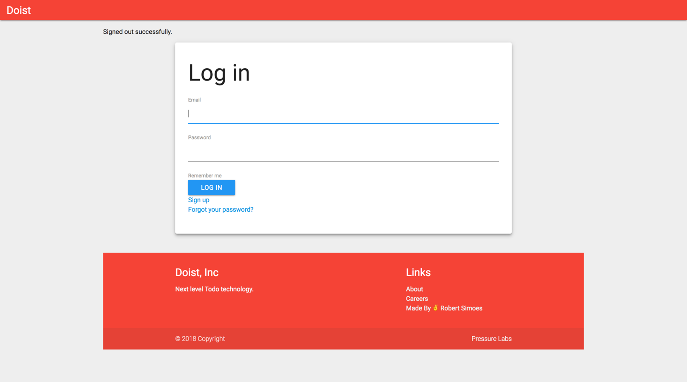

# Doist 

Doist is a simple, sleek and delightful To-do based application built in rails.

It uses basic gems such as `devise`, `materialize`, and more!

## License 

This code is licensed under [Apache 2.0](https://www.apache.org/licenses/LICENSE-2.0.html)
