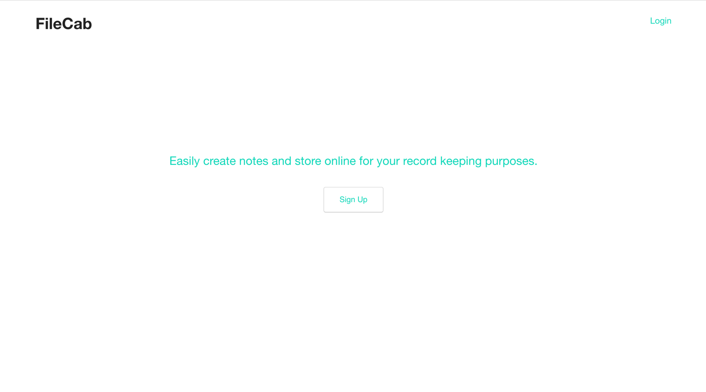
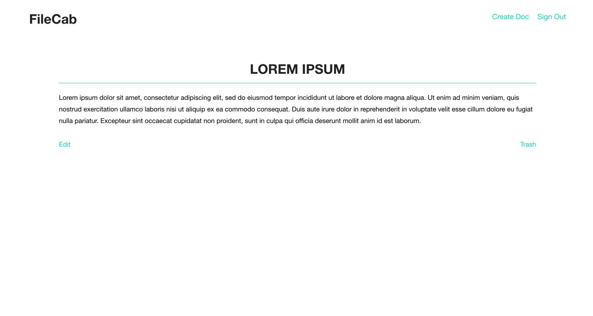
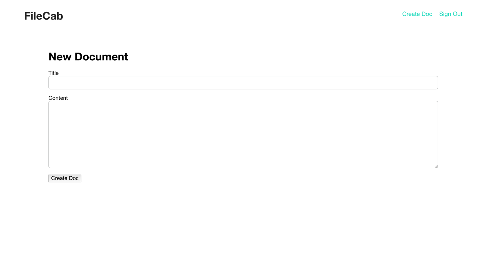
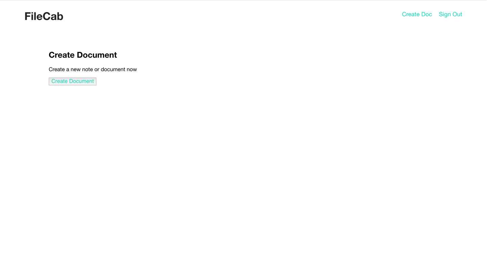

# FileCab

FileCab is a basic document/note storing Ruby on Rails app.

It tackles common concepts of `MVC` using Rails. It also leverages libraries such as `Devise`, `Simple Form` and `HAML`. 

## Licence

Apache 2.0
