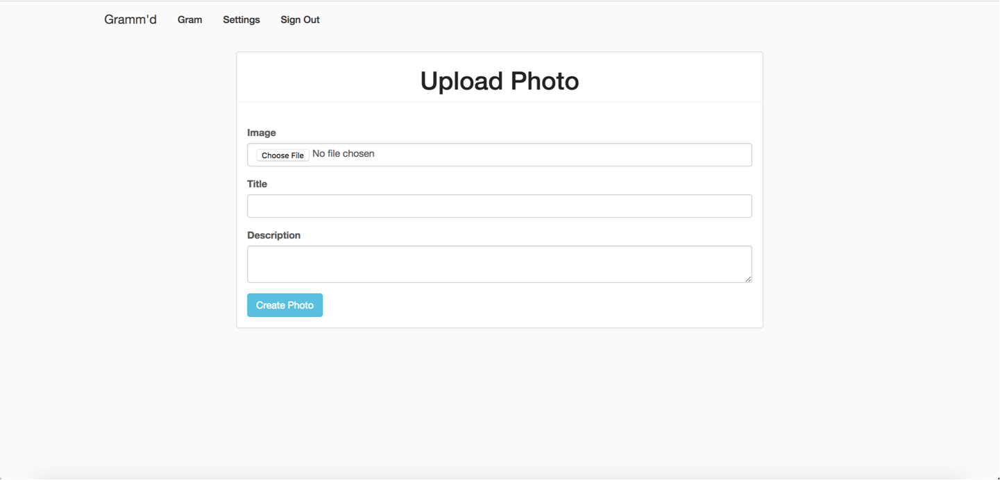

# Gramm'd

Gramm'd is a minimal photo sharing social app built using Rails, inspired by Instagram 🎉.

Users can sign up, login, post images with comments using common `CRUD` actions. 

Common gems include `masonry-rails`, `paper-clip`, `acts_as_votable`, `bootstrap`

## Gallery 

See, edit, delete and upvote photos

Editing photos

Upload new photo

## Author 

[@RobertSimoes](www.robertsimoes.com)

## License 

This code is licensed under [Apache 2.0](https://www.apache.org/licenses/LICENSE-2.0.html)