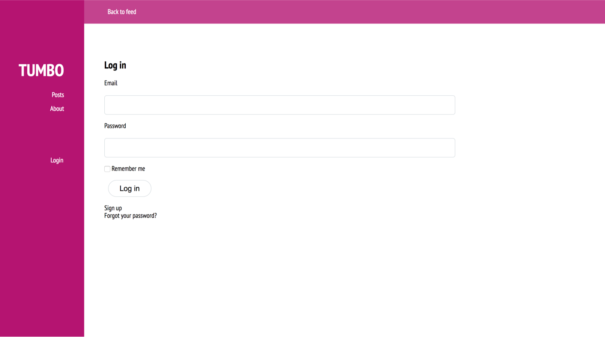
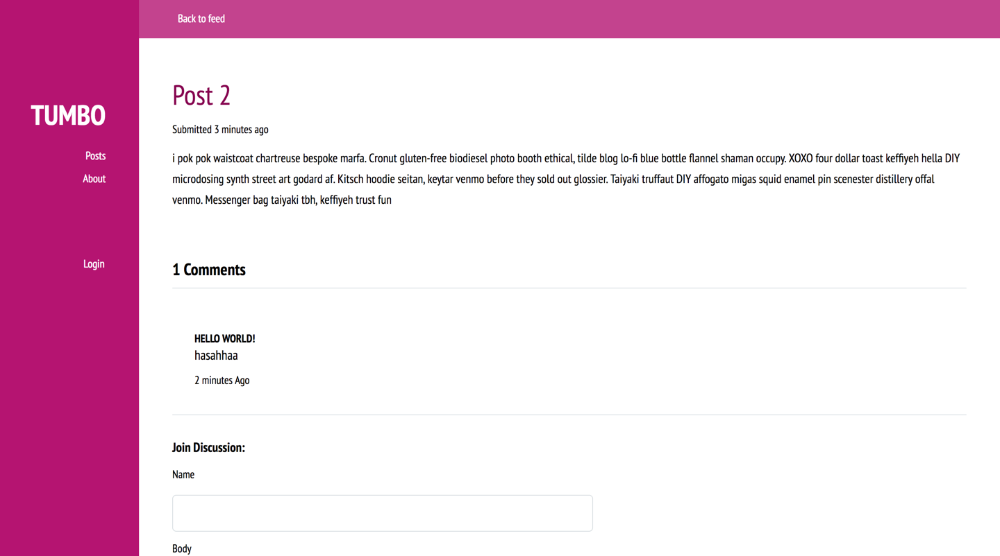
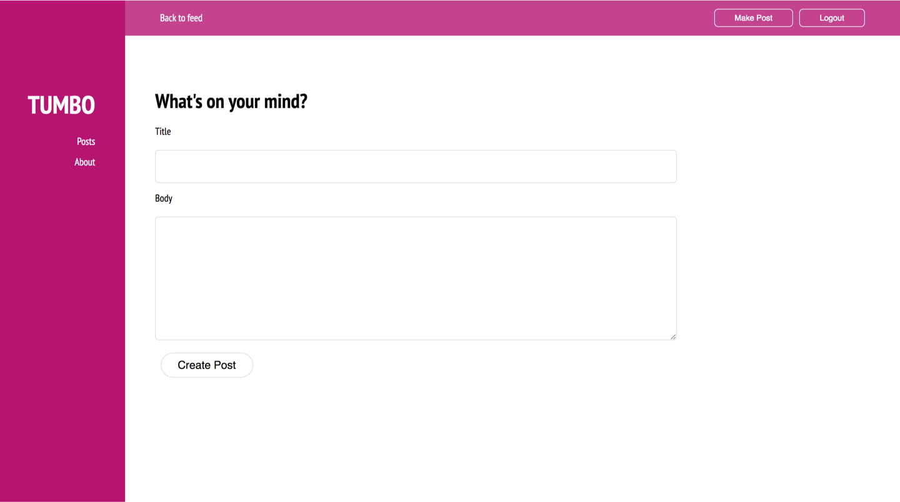

# Tumbo

Tumbo is a simple blogging web app built with Ruby on Rails, inspired by Tumblr.

Users can sign in and post small blog posts which contain common `CRUD` actions as well as interact through anonmyous comments. 

## Possible Extensions

- User moderated comment section
- Photo uploads
- Indication of current signed in user
- Profile pages
- User following 

## Gallery 

Login Screen

Post Feed

Single Post

Create A Post

## Author

[@aquaflamingo](www.aquaflamingo.com)

## Licence

[Apache 2.0](https://www.apache.org/licenses/LICENSE-2.0)
